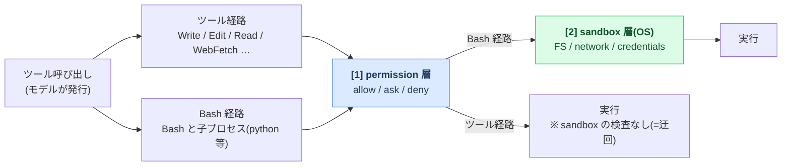

# claude-code-sandbox-experiments

Claude Code の **permission / sandbox の実際の挙動** を、公式ドキュメントを土台にしつつ
**実際に実行して経験的に確定する** ための実験リポジトリです。

- 検証環境: Claude Code **2.1.201** / Agent SDK **0.3.200** / macOS (`sandbox-exec`) / 2026-07-05
- 設計原則: **ケース定義はモダリティ非依存、実行だけがモダリティ固有**。
  前提(`.claude/settings.json`)・プロンプトと期待値(`case.json`。プロンプトは `probes[].prompt` にインライン、
  対話貼り付け用に `prompt.ja.txt`)を1回書けば、
  headless / SDK / 対話(TUI) のどの実行形態でも同じケースを検証できる。

## 全体像 — 2層 × 2経路のモデル

このリポジトリの全ケースは、次の1枚のモデルの上に載っている:



- **[1] permission 層** = Claude Code 内部の許諾エンジン(規則・モード・hooks)。`cases/P*` グループの検証対象。
- **[2] sandbox 層** = OS レベルの境界(macOS では `sandbox-exec`)。**Bash とその子プロセスにしか効かない**。
  `cases/S*` グループの検証対象。
- **ツール経路は sandbox 層を迂回する**(実測: S1 / S3-d / S6-h)。だから「本当に守る」には
  permission の deny と sandbox の両層を併用する(→ [docs/BEST-PRACTICES.md](./docs/BEST-PRACTICES.md))。
- 実行形態(headless / SDK / 対話 = モダリティ)が変えるのは **ask の解決方法だけ**(→ 後述)。

このモデルの詳細(permission 層の評価パイプライン・sandbox の3境界・2層併用の正解形・
各グループが図のどこを検証しているか)は **[docs/ARCHITECTURE.md](./docs/ARCHITECTURE.md)**。

## 読み筋 — 目的別の入口

| 目的 | 読み順 |
|---|---|
| 全体の仕組みを図で掴みたい | [docs/ARCHITECTURE.md](./docs/ARCHITECTURE.md)(2層×2経路の全体像と制御点の地図) |
| 挙動の結論だけ知りたい | [docs/FINDINGS.md](./docs/FINDINGS.md) → [cases/README.md](./cases/README.md)(21グループ一覧・疑問からの逆引き) |
| 安全な設定を組みたい | [docs/BEST-PRACTICES.md](./docs/BEST-PRACTICES.md) → 根拠は FINDINGS へ |
| 実行環境(分離手段)を選びたい | [docs/SANDBOX-ENVIRONMENTS.md](./docs/SANDBOX-ENVIRONMENTS.md)(公式6手段の使い分け × 実測) |
| 個別ケースを探して読みたい | [cases/README.md](./cases/README.md) → 各グループ README → サブケース README |
| ケースを追加・実測したい | [docs/CASE-FORMAT.md](./docs/CASE-FORMAT.md) → [docs/EXECUTION-MODALITIES.md](./docs/EXECUTION-MODALITIES.md) → `templates/` |
| 用語・記号・判定値が分からない | [docs/GLOSSARY.md](./docs/GLOSSARY.md)(用語と記号の正本) |

## ディレクトリ構成

```
cases/README.md               # ★ 全バケツの一覧と「疑問 → ケース」逆引き
cases/01-permission/          # 許諾エンジン(P1-P12)。全手段共通の層
cases/02-sandbox-bash/        # 手段1=組み込み Bash sandbox(S1-S9)
  <GROUP>/                    # 1グループ=1検証軸(P*/S*)
    <SUB>/                    # サブケース(a=ベースライン, 以降は a に1変数足したもの)
      .claude/settings.json   # 前提条件: そのケースで検証する設定(全モダリティ共通)
      prompt.ja.txt           # お手軽対話用の貼り付けプロンプト(実行用プロンプトは case.json の probes[].prompt にインライン)
      case.json               # probe / 観測 / 期待値 / 実行パラメータ(モダリティ非依存)
      README.md               # ケース個別の解説(目的/設定/手順/期待/なぜ)
      results/                # 実測結果(モダリティ別・直近実行のスナップショット)
cases/03-sandbox-runtime/     # 手段2 srt の検証(a〜j の9ケース・実測済み macOS。run.py 対象外)
cases/04-devcontainer/        # 手段3 dev コンテナの検証(a〜h の6ケース・実測済み colima。run.py 対象外)
# 参照 ID は短縮形(S3-d 等)のまま。run.py は番号バケツを跨いで短縮 ID で解決する
harness/run.py                # 統合ランナー: 共通ライフサイクル + モダリティ別アダプタ
harness/sdk/exec_case.mjs     # SDK 実行アダプタ(run.py -m sdk から呼ばれる)
results/summary-<modality>.json # 全ケースの判定サマリ(モダリティ別。生成物・非コミット=gitignore。harness/aggregate_summary.py で再生成)
docs/
  ARCHITECTURE.md             # ★ permission/sandbox 全体像(2層×2経路の図と制御点の地図)
  GLOSSARY.md                 # ★ 用語・判定値・記号の正本(まずここで認識合わせ)
  CASE-FORMAT.md              # ★ ケース定義フォーマット仕様(v2)の正本
  FINDINGS.md                 # ★ 経験的に確定した挙動(証拠つき)
  EXECUTION-MODALITIES.md     # ★ 実行形態の軸(headless/対話/SDK)と ask/deny の分離
  COVERAGE.md                 # ★ 設定キー × グループ × 検証状態の一覧
  BEST-PRACTICES.md           # ★ 安全に運用するためのベストプラクティス
  SANDBOX-ENVIRONMENTS.md     # ★ 分離環境(sandbox 手段)の選択と運用(公式6手段 × 実測)
  SANDBOX-RUNTIME-FINDINGS.md # 手段2 sandbox-runtime の差分実測(ツール経路を OS 層で塞ぐ)
  DEVCONTAINER-FINDINGS.md    # 手段3 dev コンテナの実測と runbook(colima・egress firewall)
harness/srt/                  # sandbox-runtime 差分実験ランナー(run_differential.sh)
```

## 実行方法

どのモダリティも同じケース定義(settings / prompt / expected)を共有する。詳細は
[docs/CASE-FORMAT.md](./docs/CASE-FORMAT.md)。

```bash
# ケース一覧と「どのモダリティで実測済みか」
python3 harness/run.py --list

# headless(claude -p)— 既定
python3 harness/run.py                                            # 全ケース
python3 harness/run.py P4-bash-command-matching                   # グループ丸ごと
python3 harness/run.py P4-bash-command-matching/c-wrapper-bypass  # サブケース単体

# SDK(Claude Agent SDK / canUseTool = ask の計測器)。Node 20+ が必要
cd harness/sdk && npm install && cd ../..                         # 初回のみ
python3 harness/run.py -m sdk P1-permission-mode/a-default-deny

# 対話(TUI)— 人間がループに入るため prepare / judge の2段構え
python3 harness/run.py -m interactive --step prepare P1-permission-mode/a-default-deny
#   → 前提整備を済ませ、叩くコマンドと貼り付けるプロンプトを提示
#   → 人間がそのディレクトリで claude を起動して実行・観察
python3 harness/run.py -m interactive --step judge P1-permission-mode/a-default-deny
#   → 観察を記録(results/interactive.json)し、後片付け
```

モデルは全モダリティ共通で環境変数 `LAB_MODEL` で指定(既定 `claude-haiku-4-5-20251001`)。
`harness/run.py <target>` は各ケースを **そのケースのディレクトリを cwd にして** 実行するので、
そのディレクトリの `.claude/settings.json` が有効な project 設定になる。

## モダリティ非依存の仕組み(要点)

permission エンジンの判定(allow / deny / ask)はどの実行形態でも共通で、
**モダリティが変えるのは「ask の解決方法」だけ**:

| 実行形態 | `ask` の解決 |
|---|---|
| headless (`claude -p`) | 承認者不在 → **auto-deny** |
| SDK | `canUseTool` コールバックが決定(発火 = ask の証跡) |
| 対話(TUI) | 人間に承認プロンプト |

そのため `case.json` の期待値は `expected.engine`(allow/deny/ask)で1回書けば、
ハーネスが各モダリティの期待 verdict に展開する(→ [docs/CASE-FORMAT.md](./docs/CASE-FORMAT.md))。
OS 層(sandbox: filesystem / network / credentials)の観測はモダリティ非依存なので
`expected.observed` を全モダリティ共通の期待値として使う。

## 判定ロジック(probe)

`case.json` の `probe` が「何を一次情報として観測するか」を決める。

| probe | 観測 | ALLOWED / DENIED の判定 |
|---|---|---|
| `permission`(既定) | ツールがブロックされたか | 副作用ファイル + `permission_denials`(headless) / `canUseTool` 発火(SDK) |
| `fs-write` | 指定パスへ書けたか | ディスク上に `sideEffects` が出来たか + 試行痕跡(`attempted`) |
| `fs-read` / `credential-leak` | 秘密が出力に漏れたか | 出力中の番兵(実値) + 実行痕跡(`execMarker`) |
| `network` | ドメインに到達できたか | 成功マーカー + 非 sandbox プリフライト + 試行痕跡(`attempted`) |

`attempted` = 対象ツールの tool_use が実際に発行されたかの構造的証跡。副作用が無くても
**試行の証跡が無ければ DENIED ではなく INCONCLUSIVE** に落とす(モデルの自己拒否や
API エラーを「遮断」と誤記録しない = fail-closed な判定)。

headless の `permission_denials` はモデルの言い訳ではなく **ハーネスが実際にブロックした記録**
なので ground truth として使う。ただし headless は「deny 規則によるハード拒否」と
「ask の auto-deny」を構造的に区別できないため、SDK 実測(`results/sdk.json`)があればそれを
正として `engine_decision` に内訳を出す(→ [docs/EXECUTION-MODALITIES.md](./docs/EXECUTION-MODALITIES.md))。

### ケース README「期待結果」表の凡例

ケース README の期待結果は `| No | 操作 | 許諾 | 結果 | 補足 |` の5列で、permission 層と
最終結果(OS 層含む)を分けて示す。**凡例の正本は [docs/GLOSSARY.md](./docs/GLOSSARY.md) §7**
(書式仕様は [docs/CASE-FORMAT.md](./docs/CASE-FORMAT.md))。
`allow × ❌` = 「permission は通ったが sandbox(OS 層)が実行時に止めた」の典型署名。
