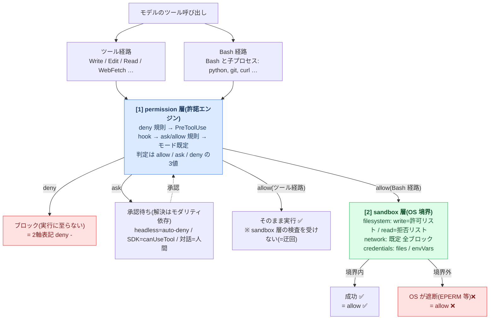
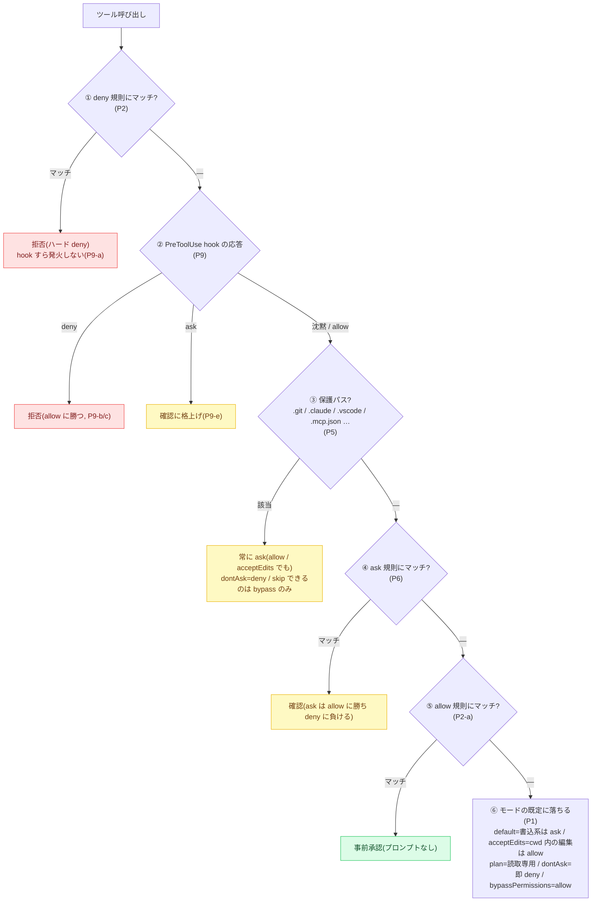
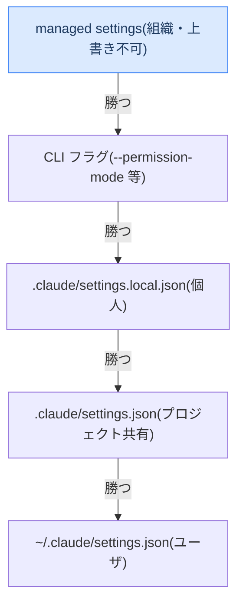
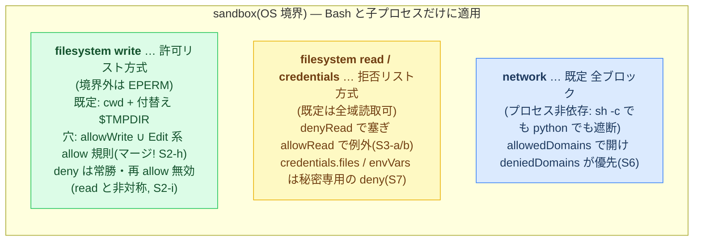

# ARCHITECTURE — Claude Code の権限制御の全体像(permission / sandbox)

Claude Code のセキュリティ・権限制御は、**性格の違う2つの独立した仕組み**の重ね合わせでできている:

| | [1] permission 層 | [2] sandbox 層 |
|---|---|---|
| 何者か | Claude Code **内部**の許諾エンジン | **OS レベル**の実行境界(macOS: `sandbox-exec`) |
| いつ働くか | ツール呼び出しの**実行前**(許可を判定) | コマンドの**実行中**(違反操作を遮断) |
| 対象 | すべてのツール呼び出し | **Bash とその子プロセスだけ** |
| 判定 | allow / ask / deny | 成功 / EPERM 等の OS エラー |
| 検証グループ | `cases/P1`〜`P12` | `cases/S1`〜`S9` |

この文書は両層の構成と制御の流れを図で示す。**各主張は本リポジトリの実測ケースに紐づく**
(根拠の詳細は [FINDINGS.md](./FINDINGS.md)、用語は [GLOSSARY.md](./GLOSSARY.md))。

---

## 1. 一枚図 — 2層 × 2経路

最重要ポイントは「**どの層を通るかは操作の“経路”で決まる**」こと。同じ「ファイルに書く」でも、
Write ツール経由と Bash の `echo >` 経由では通る検査が違う。

この図から、実測で頻出する4つの「結果の型」が読める(2軸表記は [GLOSSARY.md](./GLOSSARY.md) §3):

| 型 | 意味 | 典型例 |
|---|---|---|
| `deny -` | permission 層でハードブロック(実行に至らない) | `deny Write(*)` に当たった Write(P2-b) |
| `ask ✅` | 承認すれば完遂できる(headless では auto-deny で ❌ に見える) | default モードの Write(P1-a) |
| `allow ✅` | 両層とも通過 | sandbox 内 Bash の cwd 書込(S2-a) |
| **`allow ❌`** | **permission は通ったが sandbox(OS)が実行時に止めた** | sandbox 内 Bash の cwd 外書込(S2-c) |

> 「deny してないのに拒否される」の正体はたいてい `ask ✅` × headless(FINDINGS Q1)、
> 「sandbox なのに permission を要求される」の正体はツール経路が sandbox の対象外なこと(FINDINGS Q2)。

---

## 2. [1] permission 層 — 「実行してよいか」を決める許諾エンジン

### 2.1 評価パイプライン(厳しいものから順に当たる)

- **① deny の現れ方は2つ**: 呼び出し時拒否(`permission_denials[]` に記録)とツールセット除去
  (ツール自体が消え、denials も副作用も出ない)(P2-b vs P2-c)。
- **② hook の allow が上書きできるのは「規則が沈黙している領域の既定 ask」だけ**(P9-a/d)。
- **③ 保護パスの位置**: 実測済みなのは「allow 評価より上流」(P5-f)。hook との前後は未実測。

- **評価順は deny → ask → allow**。広い allow の内側を狭い deny で塞ぐことはできるが、
  広い deny の内側に狭い allow で穴を開けることは**できない**(P2-e)。
- **deny 規則はモードに勝つ**。acceptEdits でも bypassPermissions でも deny は生存する(P2-c/d)。
  bypass で消えるのは「既定 ask(⑥)」と「保護パス ask(③)」だけ(P1-e / P5-e →
  [BEST-PRACTICES 鉄則E](./BEST-PRACTICES.md))。

### 2.2 規則はどこから来るか(設定スコープと trust)

(矢印は「同一キーが衝突したとき上位が採用される」の向き。優先度: 上が高・下が低)

- 同一キー(`defaultMode` 等)の衝突は上の順位どおり(P7-b/d)。ただし **allow/ask/deny 配列は
  「上書き」ではなく「マージ」**され、**deny はどのスコープからでも勝つ**(P7-a)。
- **未 trust のワークスペースでは project の allow だけが無視される**(deny/ask は効いたまま)。
  「project に allow を書いたのに CI で効かない」の正体(P7-c)。
- **subagent へ委譲しても「守り」は継承される**(deny・sandbox とも)。緩みうるのはモードだけで、
  リポジトリ持ち込みの `.claude/agents/*.md`(frontmatter `permissionMode`)が昇格経路になる(P8)。

### 2.3 マッチングの罠 — 「規則を書いた ≠ 守られている」

permission 規則は**文字列マッチ**であり、形を間違えると**エラーも警告もなく無効**になる:

| 罠 | 実測 | 根拠 |
|---|---|---|
| **Write のパス限定はどの表記でも no-op**(`Write(dir/**)`・完全パス・`~` 形 …) | 素通り | P3 / S9-a |
| 個別ファイル/ディレクトリの正解形は **`deny Edit(path)` / `Edit(dir/**)`**(Write ツールも覆う) | ハード deny | P3-e / S9-a3 |
| Bash のチェーン(`&&` `;` `\|`)はサブコマンド単位で照合され**すり抜けない** | 止まる | P4-b/g |
| `sh -c '...'`・`$(...)` 等の**剥がされないラッパー**の中身は照合されない | すり抜ける | P4-c |
| `additionalDirectories` の別ルートに cwd 起点の規則はマッチしない(無言の no-op) | 素通り | S9-d |
| **Edit 規則の絶対アンカーは `//`・`~/` が効き、単一スラッシュ `/abs/…` は allow/deny とも無言 no-op** | 素通り | P12-c/g(効く形は d=`//` / e=`~/`) |
| Edit 規則の**相対形は絶対パス呼び出しにマッチ**(表記差でエスケープしない・`..` 難読化も不成立)=相対が最も堅い | 効く | P12-a/b/f |

→ だから運用の大原則は「**設定は撃って確かめる**」([BEST-PRACTICES](./BEST-PRACTICES.md) §0)。

### 2.4 ask の解決はモダリティ(実行形態)で変わる

permission エンジンの判定自体はどの実行形態でも同じで、**変わるのは ask の解決方法だけ**
(→ [EXECUTION-MODALITIES.md](./EXECUTION-MODALITIES.md)):

| 実行形態 | ask の解決 | 含意 |
|---|---|---|
| headless(`claude -p` / CI) | 承認者不在 → **auto-deny** | fail-closed。deny 規則との区別は外から見えない |
| SDK(Agent SDK) | `canUseTool` コールバック | コードがポリシーエンジンになる(発火 = ask の証跡) |
| 対話(TUI) | 人間に承認プロンプト | 承認疲れ・injection が弱点 |

---

## 3. [2] sandbox 層 — OS が物理的に止める実行境界

### 3.1 対象は Bash とその子プロセスだけ

sandbox は「Bash コマンドを OS サンドボックス内で走らせる」仕組みであって、permission を
無効化するものではない。**組込ツールは sandbox の検査を受けない**(=迂回する。§4)。

### 3.2 3つの境界(既定値と穴の開け方)

- パス照合は **glob 非対応(リテラル)**(S2-e)で、FS は **symlink 解決済み**で照合(S2-k。socket は非解決 = S6-f)。
- **settings.json 自身への書込は自動 deny**(自己ポリシー改変防止, S2-f)。

### 3.3 auto-allow — sandbox が permission 層を「緩める」唯一の接点

`autoAllowBashIfSandboxed`(既定 true)は「sandbox 内で走る Bash は承認プロンプトを省く」機能。
2層をまたぐ唯一の連携点で、**飛ばすのは「既定 ask」と「bare `Bash` ask 規則(sandbox 実行分)」だけ**(S4-e):

- 明示 **deny 規則は貫通**して止まる(S4-g)。content-scoped な **ask 規則(`Bash(git push *)` 形)も貫通**してプロンプトになる(S4-f)。「全 Bash を確認制に」のつもりの bare `ask:["Bash"]` は sandbox 下では素通りする点に注意(S4-e)。
- 「境界は OS が担保しているから承認を省ける」という理屈なので、境界(§3.2)の設定がそのまま安全性になる。

### 3.4 脱出経路(sandbox の外で実行させる設定)

| 経路 | 挙動 | 増幅要因 |
|---|---|---|
| `excludedCommands` | 該当コマンドを含む**行全体**が sandbox 外で実行(S5-a/b) | 広い `Bash(*)` allow が |
| `allowUnsandboxedCommands: true` | sandbox 内で失敗したコマンドの**外部再試行**を許す(S5-c) | 承認を自動化し無条件脱出に(S5-e/h) |

---

## 4. 2層の交点 — 経路 × 層のマトリクスと多層防御の正解形

### どの経路をどの層が止めるか(全セル実測)

| 操作の経路 | permission 層 | sandbox 層 |
|---|:---:|:---:|
| Bash コマンド | ✅ 効く(P4) | ✅ 効く(S2/S3/S6) |
| Bash の子プロセス(python 等) | ❌ 及ばない(S3-g) | ✅ 効く(S3-e / S6-e / S7-i) |
| Write / Edit / Read ツール | ✅ 効く(効く形なら → §2.3) | ❌ **迂回**(S1-f / S3-d / S7-b) |
| WebFetch | ✅ `WebFetch(domain:…)` 規則で効く(deny=当該ドメイン取得をブロック / allow=domain allowlist で列挙ドメインだけ・別ドメインは ask / `*.example.com`=サブドメイン一致。P10-a/b/c/d) | ❌ **迂回**(S6-h) |

> **この表の sandbox 層は手段1(組み込み Bash sandbox)まで**。手段2(sandbox-runtime)は同じツール経路の
> sandbox 層 ❌ を **OS 層 ✅ に反転**させる(claude プロセス全体を Seatbelt で包むため。Read/Write/Edit・MCP・
> hooks・WebFetch の各迂回が OS 境界で塞がる → [SANDBOX-RUNTIME-FINDINGS.md](./SANDBOX-RUNTIME-FINDINGS.md))。
> 手段3(dev コンテナ)はさらに外側で包む(→ [DEVCONTAINER-FINDINGS.md](./DEVCONTAINER-FINDINGS.md))。
> 選択の指針は [SANDBOX-ENVIRONMENTS.md](./SANDBOX-ENVIRONMENTS.md)。

**片方の層だけでは必ず穴が残る**(対角に ❌ がある)。だから「本当に守りたいもの」は2層併用が正解形:

| 守りたいもの | permission 層に書く | sandbox 層に書く | 根拠 |
|---|---|---|---|
| 秘密ファイルの読取 | `deny Read(path)` | `denyRead` / `credentials.files` | S3-i / S7-j |
| ディレクトリへの書込 | `deny Edit(dir/**)` | `denyWrite` | S9 / P3-f |
| ネットワーク | (文字列 deny は境界にならない P4-c) | `network.allowedDomains` ほか | S6 |
| 環境変数の秘密 | — | `credentials.envVars`(組込リストは無い S7-k) | S7-d |

---

## 5. この図とケースグループの対応(各ケースの意義)

21 グループは、上の図の**制御点を1つずつ切り出して実測**したもの
(一覧と逆引きは [cases/README.md](../cases/README.md)、網羅状況は [COVERAGE.md](./COVERAGE.md)):

**[1] permission 層(P\*)** — §2 のパイプライン番号と対応:

| 図の制御点 | グループ |
|---|---|
| ⑥ モード既定 | P1 permission-mode |
| ①⑤ deny/allow の優先・現れ方 | P2 allow-deny-precedence |
| 規則マッチング(Write glob の罠) | P3 write-glob-asymmetry-DANGER |
| 規則マッチング(Bash コマンド照合) | P4 bash-command-matching |
| ③ 保護パス | P5 protected-paths |
| ④ ask 規則(3値の真ん中) | P6 ask-rules |
| 規則の供給源(スコープ・trust) | P7 settings-scope-precedence |
| 委譲時の継承(subagent) | P8 subagent-inheritance |
| ② PreToolUse hook | P9 hooks-vs-permission |
| 規則マッチング(WebFetch/WebSearch の domain 規則) | P10 webfetch-rules |
| 規則マッチング(MCP ツール規則 `mcp__server__tool`) | P11 mcp-tool-rules |
| 規則マッチング(パスのアンカー表記) | P12 path-anchor-matching |

**[2] sandbox 層(S\*)** — §3 の境界・接点と対応:

| 図の制御点 | グループ |
|---|---|
| 適用範囲(Bash 限定・ツールは迂回) | S1 sandbox-scope-vs-tools |
| filesystem write(許可リスト) | S2 sandbox-fs-write |
| filesystem read(拒否リスト) | S3 sandbox-fs-read |
| auto-allow(2層の接点) | S4 sandbox-autoallow-behavior |
| 脱出経路(excluded / unsandboxed) | S5 sandbox-excluded-and-unsandboxed |
| network | S6 sandbox-network |
| credentials(秘密の保護) | S7 sandbox-credentials |
| git との相互作用(実務での詰まり) | S8 sandbox-git-interop |
| 2ベクタ防御(ツール層 × OS 層の交点) | S9 tool-write-scope |

読み方の例: 「S2-c が `allow ❌`」= §1 の図で Bash 経路が permission 層を通過(allow)した後、
sandbox 層の write 許可リスト外(cwd 外)で OS に止められた、ということ。図の**どの箱で止まったか**が
2軸表記(許諾 + 結果)にそのまま対応する。

## 対応する知識

- [FINDINGS.md](./FINDINGS.md) — 各制御点の実測結果(証拠つき)
- [BEST-PRACTICES.md](./BEST-PRACTICES.md) — この構成を踏まえた安全な設定の型
- [EXECUTION-MODALITIES.md](./EXECUTION-MODALITIES.md) — ask の解決とモダリティ
- [GLOSSARY.md](./GLOSSARY.md) — 用語・判定値・記号の正本
