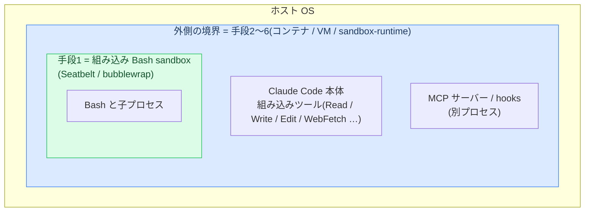
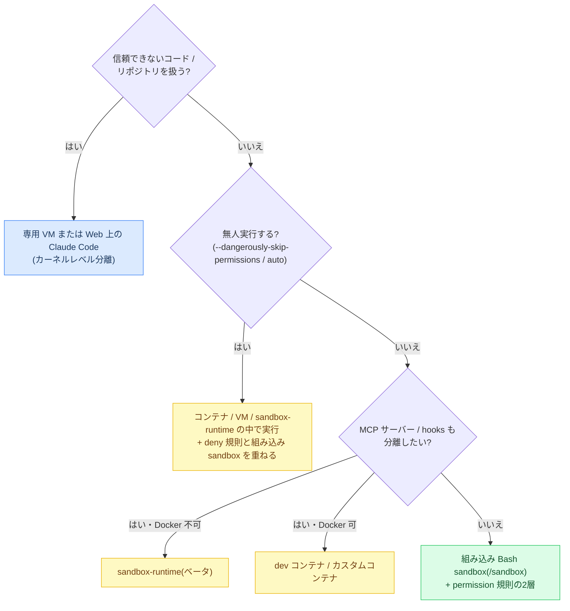

# SANDBOX-ENVIRONMENTS — 分離環境の選択と運用(公式6手段 × 本リポジトリの実測)

公式 docs [sandbox-environments](https://code.claude.com/docs/ja/sandbox-environments)(2026-07-06 確認)は、
Claude Code の分離環境として6つの手段を提示している。この文書はそれを本リポジトリの実測結果と突き合わせ、
**どの運用にどの手段が適しているか**を整理する。

> **スコープ注記**: 実測済みは手段1(組み込み Bash sandbox・S1〜S9)+ permission 層(P*)、
> **手段2 sandbox-runtime**([SANDBOX-RUNTIME-FINDINGS](./SANDBOX-RUNTIME-FINDINGS.md))、
> **手段3 dev コンテナの核心特性**([DEVCONTAINER-FINDINGS](./DEVCONTAINER-FINDINGS.md)・colima)。
> 手段4〜6 は一次 docs 由来(documented-only)で未実測。各主張の末尾に「実測(ケースID/文書)」か「一次 docs」かを明記する。

---

## 1. 公式が示す6つの手段

| # | 手段 | 分離されるもの | Docker | 手間 | 本リポジトリの実測 |
|---|---|---|:---:|:---:|:---:|
| 1 | **組み込み Bash sandbox**(`/sandbox`) | Bash とその子プロセスだけ | 不要 | 最小 | ✅ S1〜S9 で実測済み |
| 2 | **sandbox-runtime**(`@anthropic-ai/sandbox-runtime`) | Claude Code プロセス全体(ファイルツール・MCP・hooks 含む) | 不要 | 低 | ✅ 差分実測済み([SANDBOX-RUNTIME-FINDINGS](./SANDBOX-RUNTIME-FINDINGS.md)) |
| 3 | **dev コンテナ**(`.devcontainer/`) | 完全な開発環境 | 要 | 中 | ✅ 核心特性を実測([DEVCONTAINER-FINDINGS](./DEVCONTAINER-FINDINGS.md)) |
| 4 | **カスタムコンテナ** | 完全な開発環境 | 要 | 中〜高 | 未実測 |
| 5 | **仮想マシン**(クラウド / microVM) | OS ごと(カーネルレベル) | 不要 | 高 | 未実測 |
| 6 | **Web 上の Claude Code** | OS ごと(Anthropic ホストの VM) | 不要 | なし | 未実測 |

構造上の分かれ目は「**何を境界の中に入れるか**」:

- **手段1だけの場合、外側の境界(青)は存在しない** = 組み込みツール・MCP・hooks はホスト直実行。
  これは公式の明言(一次 docs)であり、本リポジトリの実測とも一致する
  (Read/Write ツールは sandbox FS を迂回 = S1-f / S3-d、WebFetch は sandbox network を迂回 = S6-h、
  MCP サーバー・hooks は別プロセス経路として sandbox を丸ごと迂回 = S1-h / S1-i)。
- 手段は**重ね掛けできる**(一次 docs): コンテナ/VM の中で組み込み Bash sandbox を有効にすれば、
  外側の環境境界 + 内側のコマンド単位制限の2重になる。

---

## 2. 実測が確定した「組み込み Bash sandbox(手段1)」の守備範囲

手段1 を選ぶ・重ねる判断の前提として、実測で確定した守れるもの/守れないものを1表に畳む:

| 論点 | 実測結果 | 根拠 |
|---|---|---|
| Bash の FS write | ✅ 許可リスト方式で止まる(cwd + 付替え `$TMPDIR` が既定) | S2 |
| Bash の FS read / 秘密 | ✅ `denyRead` / `credentials.files` で止まる(子プロセスも) | S3 / S7-a,i |
| Bash の network | ✅ 既定全ブロック・プロセス非依存(`sh -c` / python でも) | S6 |
| **組み込みツール(Read/Write/Edit)** | ❌ **sandbox を迂回**(denyWrite 先に Write ツールで書ける等) | S1-f / S3-d / S7-b |
| **WebFetch** | ❌ **sandbox network を迂回**(`allowedDomains:[]` でも到達。迂回=「Bash sandbox の network 境界の対象外」の意で、permission 層の `WebFetch(domain:…)` 規則では制御可=P10) | S6-h |
| MCP サーバー / hooks | ❌ **sandbox を丸ごと迂回**(別プロセス経路。MCP が denyRead 先を read・非許可先へ net / hook が cwd 外書込) | S1-h / S1-i |
| 脱出設定 | ⚠️ `excludedCommands` / `allowUnsandboxedCommands` × 広い `Bash(*)` で cwd 外へ脱出 | S5 |
| auto-allow の緩み | ⚠️ bare `Bash` ask 規則は sandbox 実行分では素通り | S4-e |

→ 手段1 単独の守備範囲は「Bash 経路の OS 境界」まで。**ツール経路は permission 規則との2層併用が必須**
(→ [ARCHITECTURE.md §4](./ARCHITECTURE.md)、[BEST-PRACTICES.md](./BEST-PRACTICES.md))。
公式も「どちらの権限モードでも、手段1 単独では完全無人実行には不十分」と明言している(一次 docs)。

---

## 3. 運用シナリオ別の推奨

### 選択フローチャート

### A. 日常の対話利用(自分のマシン・承認プロンプトを減らしたい)

**→ 手段1(組み込み Bash sandbox)+ permission 規則**。公式の推奨と一致し、本リポジトリの実測が設定の型を裏づける:

- 設定プリセットは [BEST-PRACTICES §4](./BEST-PRACTICES.md)(sandbox enabled + ask/deny の使い分け)。
- **実測からの追加注意**:
  - `excludedCommands` / `allowUnsandboxedCommands` は入れない。入れるなら広い `Bash(*)` allow と併用しない
    (この組合せが無条件脱出になる = S5-c/e/h)。
  - 「全 Bash を確認制に」のつもりの bare `ask:["Bash"]` は sandbox 下で素通りする。特定コマンドの確認は
    content-scoped 形(`Bash(git push *)`)で書く(S4-e/f)。
  - 秘密ファイルは2層で: `credentials.files`/`denyRead`(Bash 経路)+ `permissions.deny Read()`(ツール経路)(S3-i / S7-j)。

### B. headless / CI(承認者不在の自動実行)

**→ 手段1 + モード/allow の明示。ランナー自体をコンテナ(手段3/4)にするのが定石**:

- headless の既定は fail-closed(ask = auto-deny)。「deny してないのに拒否」はこれ(FINDINGS Q1)。
  `--permission-mode acceptEdits` か allow 規則で**意図を明示**する。
- **trust の罠**: 未 trust ワークスペースでは project の allow だけが無視される(P7-c)。CI ランナーの
  プロビジョニングで config dir の trust を書くか、allow を user/managed スコープに置く。
- ネットワーク境界は permission の文字列 deny ではなく sandbox の `network.allowedDomains` で(S6 ⇔ P4-c)。
- sandbox 内では `git init` / `clone` が失敗する(S8)。リポジトリ取得は sandbox 外の prep 段階へ出す。

### C. 完全無人(`--dangerously-skip-permissions` / auto モード)

**→ 手段2〜5 のいずれかの中で実行することが必須**(公式)。本リポジトリの実測はその理由を具体化する:

- bypass では**既定 ask が全消滅**し(P1-e)、**保護パス(`.git` 等)の ask も skip される**
  — `.git/hooks` へ書ける = 任意コード実行が成立しうる(P5-e)。
- bypass でも残る防御は **deny 規則・明示 ask 規則・sandbox** だけ(P2-d / P6-d / S9-f →
  [BEST-PRACTICES 鉄則E](./BEST-PRACTICES.md))。ただし手段1 の sandbox は Bash 限定なので、
  ツール・MCP・hooks はノーガード → **プロセス全体を包む外側の境界(コンテナ/VM/runtime)が唯一の防壁**になる。
- auto モードは分類器によるアクション単位の制御であり分離境界ではない(一次 docs)。なお本リポジトリの環境では
  auto の自動承認は発現しなかった(eligibility 制 = P1-f)。
- 組織で bypass/auto 自体を封じるなら `permissions.disableBypassPermissionsMode` /
  `disableAutoMode` を managed settings に(documented-only → BEST-PRACTICES §3)。

### D. 信頼できないリポジトリ・コードの評価

**→ 手段5(専用 VM)か手段6(Web 上の Claude Code)**(公式)。実測が示す「ホスト内手段では足りない」理由:

- リポジトリ持ち込みファイルが攻撃面になる: `.claude/agents/*.md` の frontmatter
  `permissionMode: bypassPermissions` は親 default を昇格させる documented な経路(P8-c)。
  agents 定義・hooks・MCP 設定は settings と同格のレビュー対象。
- trust 機構が守るのは「project の allow を無視する」ところまで(P7-c)。持ち込み hooks / MCP は
  手段1 ではホスト直実行(一次 docs)。
- → コード自体を疑う場合はカーネルレベル分離に倒す。手段6 は GitHub トークンをサンドボックス外に保持する
  プロキシ構成(一次 docs)。

### E. チーム標準化・組織での強制

- **Claude Code 自身が強制できるのは手段1 だけ**: managed settings(MDM / サーバー管理設定)で
  `sandbox` キーを配布する(一次 docs)。**deny はどのスコープからでも勝つ**(P7-a)ので、
  守りの規則は managed に置けば開発者側で外せない。
- dev コンテナのコミットは「強制」ではなく「慣例」(Claude Code はコンテナを要求しない。一次 docs)。
  強制したければデバイス管理/ソフトウェア許可リスト側で。

### F. MCP / hooks も分離したいが Docker が使えない

**→ 手段2(sandbox-runtime)**。手段1 と同じ Seatbelt / bubblewrap でプロセス全体を包む(一次 docs)。

- ベータ研究プレビューで設定形式が変わりうる。既定は**全書込・全ネットワーク拒否**なので、起動前に
  プロジェクトディレクトリ・`~/.claude`・`~/.claude.json`・`api.anthropic.com` 等の許可設定が必要(一次 docs・実測)。
- **実測(2026-07-06, → [SANDBOX-RUNTIME-FINDINGS](./SANDBOX-RUNTIME-FINDINGS.md))**: 手段1 で迂回されていた
  **Read/Write/Edit ツールが srt 配下では OS 層(EPERM)で塞がる**ことを差分実測で確認。permission 層の結論
  (deny 勝ち・正当書込は通す)は不変。`srt claude -p` は認証も追加設定なしで通る。
  **別プロセス経路(MCP サーバー・hooks)も srt 境界内に入る**(03-f / 03-g): claude が spawn する子プロセスも
  Seatbelt 内なので、MCP の read は EPERM・MCP の net は直結遮断(`ENOTFOUND`)、hook の cwd 外書込も OS 層で塞がる。
  **WebFetch も srt の network 境界に掛かる**(03-h): 非許可ドメインは `Socket is closed` で遮断(allowedDomains に
  足せば到達 = allowlist 判定が両側で効く)。⚠️ ただし **srt の境界は FS/network のみで、環境変数の秘密はマスクされない**
  (03-j)。組み込みの `credentials.envVars`(deny=S7-d / mask=S7-e〜g)相当は srt に無い。

---

## 4. まとめ — 本リポジトリの実測が付け加える運用原則

公式の使い分け表に、実測から次の3原則を重ねる:

1. **手段1 は「Bash 経路の境界」でしかない**。ツール経路は permission 規則(効く形)との2層併用が常に必要
   (ARCHITECTURE §4 の経路×層マトリクス)。
2. **無人度を上げるほど、頼れる防御は「deny 規則・sandbox・外側の境界」に絞られる**。
   ask・保護パス・承認プロンプトは無人運用では消える側(auto-deny か skip)。
3. **どの手段でも「設定は撃って確かめる」**(BEST-PRACTICES §0)。規則の形の間違いは無言で無効になり
   (P3 / S9-d)、脱出設定の組合せは無言で境界を消す(S5)。

## 対応する知識

- [ARCHITECTURE.md](./ARCHITECTURE.md) — permission / sandbox の2層×2経路モデル(本文書の前提)
- [BEST-PRACTICES.md](./BEST-PRACTICES.md) — 手段1 + permission 規則の具体的な設定の型
- [FINDINGS.md](./FINDINGS.md) — 各主張の実測エビデンス
- 一次 docs: [sandbox-environments](https://code.claude.com/docs/ja/sandbox-environments) /
  [sandboxing](https://code.claude.com/docs/ja/sandboxing)(2026-07-06 確認)

## 検証記録

| 日付 | 内容 |
|---|---|
| 2026-07-06 | 一次 docs(sandbox-environments 日本語版)を取得・突合。手段2〜6 は documented-only、手段1 の実測は S1〜S9(v2.1.201) |
